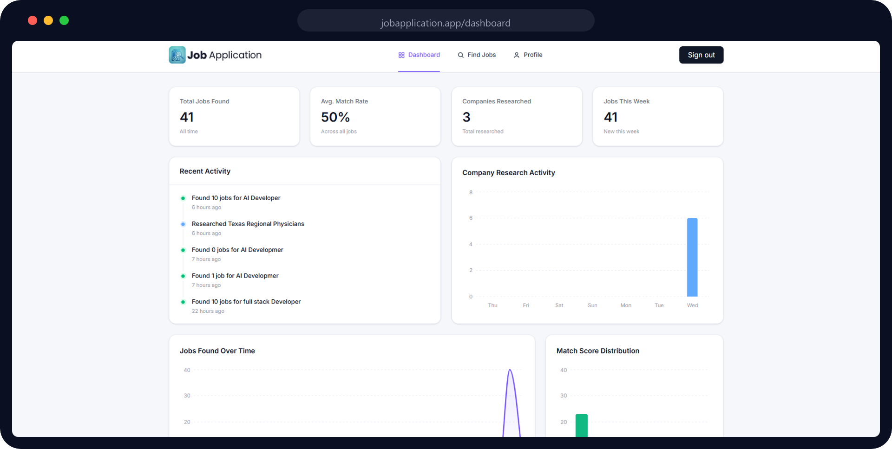
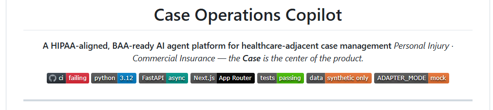

<div align="center">
  <h1>Job Application</h1>
  <p><strong>AI job-search workspace for discovering roles, scoring fit, researching companies, and generating job-tailored resumes.</strong></p>
  <p>
    
    
    
    
    
    
  </p>
</div>

---



## Why

Job hunting is repetitive: read the posting, estimate your fit, research the company, adjust your resume, and then decide whether to apply. Job Application handles the preparation layer. It finds jobs, scores them against your saved profile, researches the company, and can generate a temporary resume tailored to a specific role while keeping your base resume unchanged.

You stay in control of the final application.

## Features

### Job Discovery and Matching

- Search tech jobs by title and location through the Adzuna API.
- Score each job from 0-100 with Gemini 2.5 Flash using your saved profile, skills, and experience.
- Store matched and missing skill tags plus a written match reason.
- Filter, sort, and paginate saved jobs by match strength, score, and recency.

### Company Research Agent

- Launch a Browserbase + Stagehand browser session from a job details page.
- Visit useful company pages such as homepage, About, Blog, and Engineering.
- Synthesize a research dossier with company overview, tech stack, culture, role context, your edge, gaps to address, smart questions, and interview prep.
- Filter tech-stack claims to evidence found in company research or the job posting.

### Profile, Base Resume, and Tailored Resumes

- Maintain one saved profile with contact info, work authorization, work history, education, target titles, preferred locations, and cover-letter tone.
- Upload a base resume PDF and use Gemini extraction to prefill your profile.
- Generate a clean base resume from your profile with `@react-pdf/renderer`.
- Generate a job-scoped tailored resume from a job details page.
- Keep base and tailored resumes separate: the Profile page resume remains at `resumes/{user_id}/resume.pdf`, while job-tailored PDFs live in the `tailored_resumes` flow and expire after 15 days.

### Dashboard and Analytics

- View total jobs found, average match rate, researched companies, and jobs found this week.
- See recent job-search and company-research activity.
- Review PostHog-powered charts for jobs over time, match-score distribution, and research activity.

## How It Works

1. Sign in with Google or GitHub through InsForge auth.
2. Complete your profile manually or extract profile data from an uploaded resume.
3. Search for jobs by title and location.
4. Review match score, matched skills, missing skills, and the original posting.
5. Research the company from the job details page.
6. Generate a tailored resume for that specific job when useful.
7. Apply through the original posting link.

Research and tailored resume generation never overwrite your saved profile. The base resume flow stays on the Profile page; tailored resumes are temporary, job-scoped artifacts.

## Tech Stack

| Layer | Technology |
| --- | --- |
| Framework | Next.js 16 App Router, React 19, TypeScript |
| Styling | Tailwind CSS v4 with project UI tokens |
| Backend | InsForge: Postgres, auth, private file storage, RLS, functions |
| AI | Google Gemini 2.5 Flash through `@google/genai` |
| Browser automation | Browserbase + Stagehand |
| Job data | Adzuna API |
| Analytics | PostHog browser events, server events, and HogQL dashboard queries |
| PDF rendering | `@react-pdf/renderer` |
| Validation | Zod |
| Tests | Node test runner with `tsx` |

## Getting Started

### Prerequisites

- Node.js 20+
- InsForge project credentials
- Google AI Studio Gemini API key
- Adzuna API credentials
- Browserbase credentials
- PostHog project credentials

### Setup

1. Install dependencies.

   ```bash
   npm install
   ```

2. Copy the environment template.

   ```bash
   cp .env.example .env.local
   ```

3. Fill in the required variables.

   | Variable | Purpose |
   | --- | --- |
   | `NEXT_PUBLIC_INSFORGE_URL` | InsForge project API base URL |
   | `NEXT_PUBLIC_INSFORGE_ANON_KEY` | InsForge anonymous browser key |
   | `NEXT_PUBLIC_APP_URL` | App origin used for OAuth redirects, for example `http://localhost:3000` |
   | `GEMINI_API_KEY` | Gemini API key for matching, extraction, generation, and research |
   | `ADZUNA_APP_ID` / `ADZUNA_APP_KEY` | Adzuna job-search credentials |
   | `BROWSERBASE_API_KEY` / `BROWSERBASE_PROJECT_ID` | Browserbase session credentials |
   | `NEXT_PUBLIC_POSTHOG_KEY` / `NEXT_PUBLIC_POSTHOG_HOST` | Browser-side PostHog event capture |
   | `POSTHOG_PERSONAL_API_KEY` / `POSTHOG_PROJECT_ID` / `POSTHOG_API_HOST` | PostHog Query API for dashboard charts |
   | `TAILORED_RESUME_CLEANUP_API_KEY` | Bearer token for the scheduled cleanup function |
   | `INSFORGE_ADMIN_API_KEY` / `INSFORGE_BASE_URL` | Admin cleanup access for expired tailored resumes |

   Never commit `.env.local`; it is ignored by git.

4. Start the dev server.

   ```bash
   npm run dev
   ```

5. Open [http://localhost:3000](http://localhost:3000).

## Scripts

| Command | Description |
| --- | --- |
| `npm run dev` | Start the development server |
| `npm run build` | Create a production build |
| `npm start` | Serve the production build |
| `npm run lint` | Run ESLint |
| `npm test` | Run the unit test suite |

## Project Structure

```text
app/                  App Router pages and API routes
  api/
    agent/            Job discovery and company research endpoints
    jobs/[id]/        Tailored resume generation and download endpoints
    resume/           Base resume extract, generate, and download endpoints
    auth/             OAuth callback and session refresh endpoints
  dashboard/          Stats, activity, and analytics charts
  find-jobs/          Job search and job details views
  profile/            Profile and base resume management
actions/              Server actions for profile save and base resume upload
agent/                Gemini prompts, matchers, extractors, and research logic
components/           Feature and layout components
functions/            InsForge functions, including tailored resume cleanup
lib/                  Integrations and shared helpers
migrations/           InsForge Postgres migrations
public/images/        README and UI image assets
tests/                Unit tests
types/                Shared TypeScript types
context/              Architecture, UI, standards, and progress docs
```

## Routes

| Route | Description |
| --- | --- |
| `/` | Homepage; authenticated users are redirected to the dashboard |
| `/login` | Google and GitHub OAuth sign-in |
| `/dashboard` | Stats, activity feed, and analytics charts |
| `/find-jobs` | Job search controls and saved jobs list |
| `/find-jobs/[id]` | Job details, company research, and tailored resume action |
| `/profile` | Profile form, base resume upload, extraction, generation, and preview |
| `/api/jobs/[id]/tailored-resume` | Generate or fetch job-scoped tailored resume metadata |
| `/api/jobs/[id]/tailored-resume/download` | Stream the latest unexpired tailored resume PDF |
| `/api/resume/download` | Stream the authenticated user's base resume PDF |

## Data Model Notes

- `profiles` is the source of truth for matching and resume generation. It includes `cover_letter_tone`; that field affects copy tone but does not control profile completion.
- `jobs` stores discovered jobs, match results, matched/missing skills, source URLs, and company research dossiers.
- `tailored_resumes` stores temporary job-scoped PDF metadata, including storage key and URL. Rows are user-scoped and expire after 15 days.
- Resume storage uses private InsForge buckets. The app streams files through authenticated API routes rather than exposing private storage paths directly.
- RLS policies scope user-owned tables to the authenticated user.

## Operational Notes

- Base resume uploads are limited to 5 MB PDFs in app code; Next Server Actions are configured with a 6 MB body limit so the documented upload size can reach the server action.
- Tailored resume cleanup is handled by an InsForge function and requires a bearer token plus server-side admin credentials.
- `NEXT_PUBLIC_*` values are inlined at build time, so changing production OAuth or PostHog public values requires a redeploy.
- Generated logs are ignored with `*.log` to reduce accidental credential leakage from local tool output.

## Testing

```bash
npm test
```

The test suite covers company-research URL trust rules, tech-stack evidence filtering, dashboard helpers, profile completion, extraction sanitizing, tailored-resume prompt/storage helpers, and tailored-resume route behavior.

## README Header Pattern

The sample design you provided is called a **README hero badge header**. It uses a centered product name, a short positioning line, and compact status or stack badges.



---

Job listings powered by [Adzuna](https://www.adzuna.com/). Built with [Claude Code](https://claude.com/claude-code).
